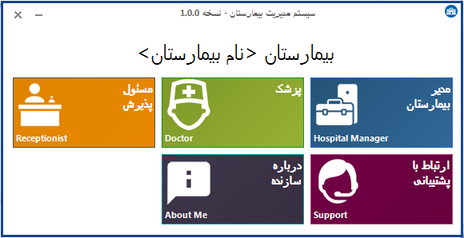

## Overview

- Three tier architecture desktop application based on Micosoft SQL Server CE (Compact) and C# .NET

## Requirements

- .NET Framework 4.7.2

- Microsoft SQL Server Compact 4.0

## Architecture

```
|__HospitalManagementSystem
  |
  |__ClassLiberty
  |         |_____DAL
  |         |_____BLL
  |__UI
  |
  |__Database
```
## Database configuration
```XML
  <connectionStrings>
    <add name="Entities" connectionString="metadata=res://*/HospitalDBModel.csdl|res://*/HospitalDBModel.ssdl|res://*/HospitalDBModel.msl;provider=System.Data.SqlServerCe.4.0;provider connection string=&quot;Data Source=|DataDirectory|\HospitalDB.sdf&quot;" providerName="System.Data.EntityClient" />
  </connectionStrings>
```
## Screenshot
- Application
  
  

## License

- Apache 2.0


